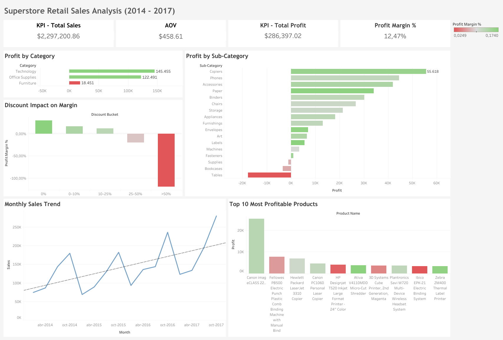

# Superstore Sales Analysis (Data Analytics Project)

## 🎯 Objective
Analyze public retail sales data to identify trends and performance insights related to:
- Revenue, profit and profit margin
- Product profitability
- Category performance
- Discount impact on profitability
- Monthly sales trends

## 🧰 Tools
- SQL Server Developer Edition
- SSMS for T-SQL queries
- Tableau Public for visualization

## 🗂 Dataset
Source: [Kaggle – Superstore Sales Dataset](https://www.kaggle.com/datasets/vivek468/superstore-dataset-final)

## 📊 Questions
- What are the total Sales, Profit, Profit Margin and Average Order Value (AOV)?
- Which product categories and sub-categories generate the highest profit and margin?
- Which are the Top 10 most profitable products?
- How do discounts affect profit and margin across different ranges?
- Are there clear monthly sales trends or seasonality patterns?

## 📈 Insights
- Total Sales: $2,297,200.86.  Total Profit: $286,397.02.  Profit Margin: 12.47%.  AOV: $458.61.
- Technology typically shows the highest profit margin, while Furniture often produces high sales but lower profitability.
- The Top 10 most profitable products concentrate a significant portion of total profit, indicating strong dependence on a small product segment.
- Discounts above 25% tend to generate negative margins, suggesting over-discounting erodes profitability. Highest margin at 0% discounts.
- Monthly sales show recognizable seasonality patterns, with year-end peaks that can inform inventory and promotional planning.

## Visuals
A Tableau dashboard was created to present KPIs and key visuals clearly and interactively.
It includes metrics such as total sales, total profit, profit margin, sales category and sub-category, top products, and discount impact.

